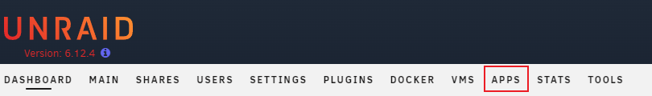
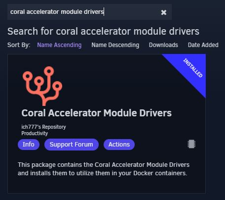
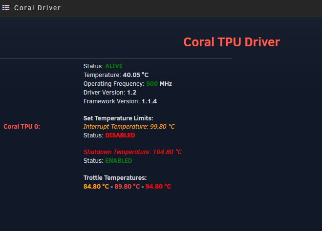

# unRAID-CoralTPU-Guide
This guide is compiled from multiple sites and with the help of multiple sources. When setting up my Google Coral TPU, I spent a good amount of time searching for how to all across the internet. 

# Hardware Installation

* USB Accelerator - https://coral.ai/products/accelerator/
* M.2 Accelerator B+M key - https://coral.ai/products/m2-accelerator-bm/
* M.2 Accelerator with Dual Edge TPU - https://coral.ai/products/m2-accelerator-dual-edgetpu/

If using the M.2 Accelerator with Dual Edge TPU you might have to use adapters to make it work with your system. These are located here:
* https://www.makerfabs.com/dual-edge-tpu-adapter.html
* https://www.makerfabs.com/dual-edge-tpu-adapter-m2-2280-b-m-key.html

Simply install the TPU in your system and boot up your unRAID server.

# unRAID Coral Drivers Installation

First you must make sure you have the community applications installed. This can be done by going here: https://forums.unraid.net/topic/38582-plug-in-community-applications/

Go to the APPs tab:

In the search bar type: coral accelerator module drivers

Once installed, you can go to SETTINGS > CORAL DRIVER and if unRAID can see your TPU then you will see something like this:

