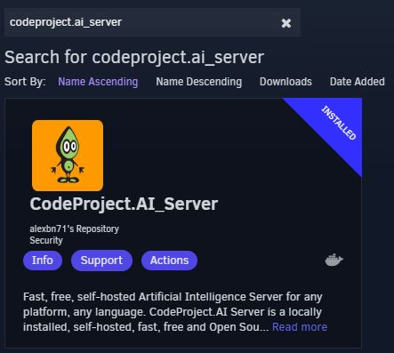
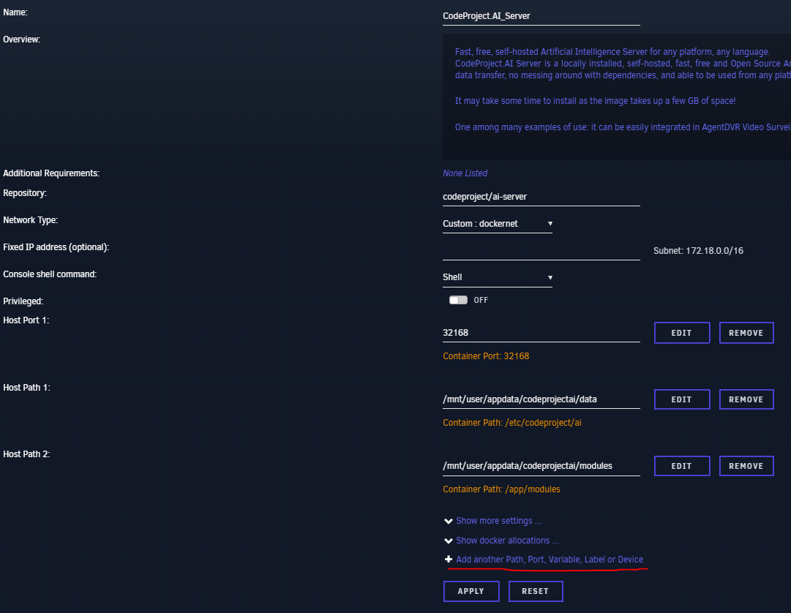
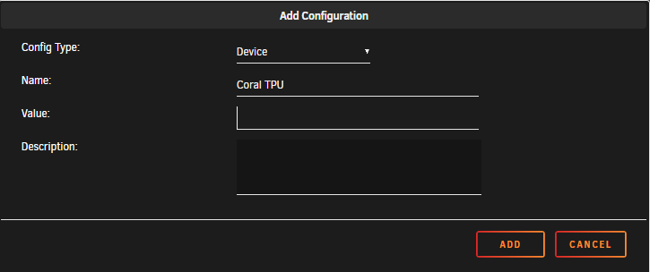
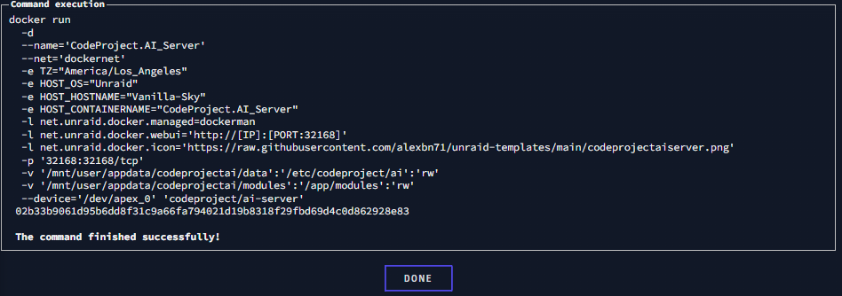

# unRAID-CoralTPU-Guide w/ CodeProject.AI
This guide is compiled from multiple sites and with the help of multiple sources. When setting up my Google Coral TPU, I spent a good amount of time searching for how to all across the internet. 

# Hardware Installation

* USB Accelerator - https://coral.ai/products/accelerator/
* M.2 Accelerator B+M key - https://coral.ai/products/m2-accelerator-bm/
* M.2 Accelerator with Dual Edge TPU - https://coral.ai/products/m2-accelerator-dual-edgetpu/

If using the M.2 Accelerator with Dual Edge TPU you might have to use adapters to make it work with your system. These are located here:
* https://www.makerfabs.com/dual-edge-tpu-adapter.html
* https://www.makerfabs.com/dual-edge-tpu-adapter-m2-2280-b-m-key.html

Simply install the TPU in your system and boot up your unRAID server.

# unRAID Coral Drivers Installation

First you must make sure you have the community applications installed. This can be done by going here: https://forums.unraid.net/topic/38582-plug-in-community-applications/

Go to the APPs tab:

In the search bar type: coral accelerator module drivers

Once installed, you can go to SETTINGS > CORAL DRIVER and if unRAID can see your TPU then you will see something like this:

# CodeProject.AI Docker Install

Go back to the APPS TAB in unRAID and search for Codeproject

Click on it and press install. It will take you to a page that looks like this:

We need to pass through our Coral TPU - Click "Add another Path, Port Variable, Label or Device"

Change Config Type to "Device"

For Value:
* USB - /dev/bus/usb
* M.2 - /dev/apex_0
* Dueal Edge TPU - /dev/apex_0

Press ADD
Then press APPLY
It will pull the image and run the docker run command and you should have an output similiar to this: 

# CodeProject.AI Coral Module Installation

This is where a lot of issues arrive and this will probably be updated with new releases of CPAI. The module does not like to be installed. There are other work arounds, but the one that worked for me was to stop all ObjectDetection modules, Uninstall Coral Module, and re-install Coral Module until it worked via watching in the system log tab. If there are any "pip" error messages then try and reinstall until sucessful. Credit for this work around goes to PeteUK on the codeproject discusions. 
This will most likely change once CPAI is updated.

